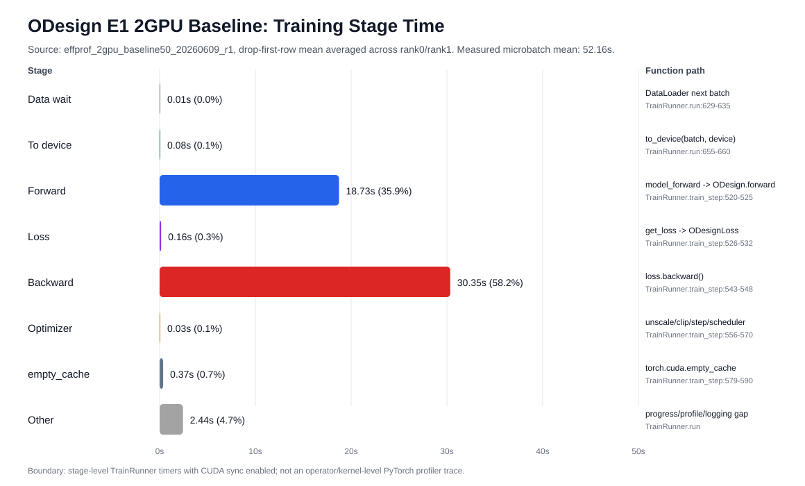

# ODesign E1 训练阶段耗时 Profile 图

数据来源：`effprof_2gpu_baseline50_20260609_r1` 的 `summary_steady_v2.json`，使用排除每个 rank 第一条 cold-start row 后的均值，并对 rank0/rank1 取平均。该 run 为 2GPU H200、50 optimizer updates、250 microbatches/rank，`returncode=0`。

## 阶段耗时

| stage | mean sec/microbatch | share | 主要函数路径 |
| --- | ---: | ---: | --- |
| `Data wait` | `0.005s` | `0.0%` | `DataLoader next batch`; `TrainRunner.run:629-635` |
| `To device` | `0.076s` | `0.1%` | `to_device(batch, device)`; `TrainRunner.run:655-660`, `src/utils/model/torch_utils.py:61` |
| `Forward` | `18.734s` | `35.9%` | `model_forward -> ODesign.forward`; `TrainRunner.train_step:520-525` |
| `Loss` | `0.157s` | `0.3%` | `get_loss -> ODesignLoss`; `TrainRunner.train_step:526-532` |
| `Backward` | `30.347s` | `58.2%` | `loss.backward()`; `TrainRunner.train_step:543-548` |
| `Optimizer` | `0.030s` | `0.1%` | `unscale/clip/step/scheduler`; `TrainRunner.train_step:556-570` |
| `empty_cache` | `0.368s` | `0.7%` | `torch.cuda.empty_cache`; `TrainRunner.train_step:579-590` |
| `Other` | `2.439s` | `4.7%` | `progress/profile/logging gap`; `TrainRunner.run` |

测得 microbatch total mean 约 `52.16s`。其中 backward 约 `30.35s`，forward 约 `18.73s`，两者合计约 `49.08s`，占单 microbatch 时间约 `94.1%`。

## 函数归因边界

当前 E1 profiling 是 `TrainRunner` stage-level timer，不是 PyTorch profiler 的 operator/kernel 级 trace。因此图中“耗时在哪些函数中”的粒度是：

- `data_wait`: `TrainRunner.run()` 中等待 `for batch in self.train_dl` 产出下一批数据。
- `to_device`: `TrainRunner.run()` 中 `to_device(batch, self.device)`，实现位于 `src/utils/model/torch_utils.py:61`。
- `forward`: `TrainRunner.train_step()` 调用 `self.model_forward()`，进一步进入 `ODesign.forward()`，覆盖 input embedding、MSA、Pairformer、Diffusion、pairwise head 等模型前向路径。
- `loss`: `TrainRunner.train_step()` 调用 `self.get_loss()`，进一步进入 `ODesignLoss` 及各 loss component。
- `backward`: `scaler.scale(loss / iters_to_accumulate).backward()`，反传覆盖 forward/loss 中参与梯度的全部算子。
- `optimizer`: `scaler.unscale_`、grad clip、`optimizer.step()`、`zero_grad()`、scheduler step。
- `empty_cache`: `torch.cuda.empty_cache()`。

要进一步回答 forward/backward 内部具体是 Pairformer、Diffusion、lDDT loss 还是某个 attention kernel 在耗时，需要启动 PyTorch profiler 或更细粒度 module-level timers。当前图只能支持训练 loop stage 层面的瓶颈判断。
