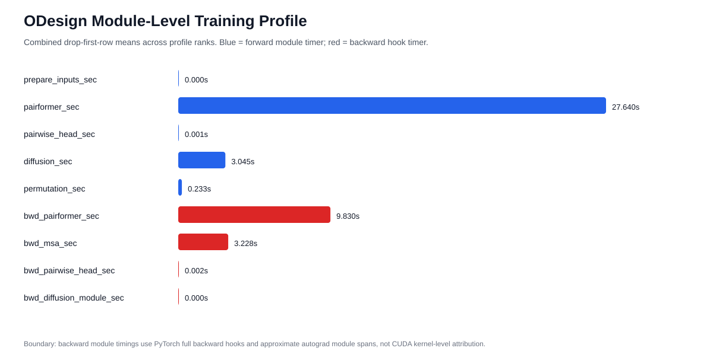

# ODesign Module-Level Profiling 结果

本文记录 2026-06-09 在用户提供的 2GPU H200 长时容器中完成的 ODesign module-level profiling。它用于回答 E1/E2 之后的核心性能问题：`forward/backward` 内部到底慢在哪些模块，以及 `blocks_per_ckpt=1` 是否值得进入后续配置 sweep。

本文只支持训练速度和模块耗时判断，不支持 PBP 质量结论，也不证明任何 checkpoint 达到目标分数。

## 结论



本次正式短跑 `module_profile_2gpu_10upd_20260609_r1` 成功完成：

| item | value |
| --- | --- |
| returncode | `0` |
| rows | `50 rows/rank`, `100 total` |
| steady rows | drop first row per rank, `98 total` |
| wall time | `3310s`, about `55.2min` |
| GPU/runtime | `2 x H200`, pod `zjow-odesign-pbp-efficiency-2gpu-4607978-8rw86` |
| record dir | `/mnt/shared-storage-user/ai4sreason/zhangjinouwen/Project/debug_5/ODesign/.cluster_operator/module-profile-runtime-0609/ODesign/.cluster_operator/module_profile_2gpu_10upd_20260609_r1` |
| output dir | `/mnt/shared-storage-user/ai4sreason/zhangjinouwen/Project/debug_5/ODesign/.cluster_operator/module-profile-runtime-0609/ODesign/outputs/module_profile_2gpu_10upd/module_profile_2gpu_10upd_20260609_r1` |

主要观察：

- `forward` 平均 `30.921s/microbatch`，其中 `Pairformer` 平均 `27.640s`，占 `forward` 的 `89.4%`。
- `Diffusion` forward 平均 `3.045s`，占 `forward` 的 `9.8%`。
- `pairwise_head` forward 和 `permutation` 都很小，分别约 `0.001s` 和 `0.233s`。
- `backward` 平均 `29.790s/microbatch`。module backward hook 近似显示 `Pairformer` 约 `9.830s`，`MSA` 约 `3.228s`，二者是已观测 hook 时间里最大的两项。
- `module_profile_backward_diffusion_module_sec` 近似为 `0`，这说明当前 hook 粒度没有把 diffusion/loss 相关 backward 成本归到 `diffusion_module` 上；它不等于 diffusion 对 backward 完全无开销。

直接决策：

- 后续不应优先继续扩大 `empty_cache` 或 lDDT chunk sweep。E2 已显示它们不是主瓶颈。
- 2026-06-09 用户进一步明确第一阶段应保持训练 setting 不变，通过算子和 runtime 加速提升 forward/backward 速度。因此 `exp.model.blocks_per_ckpt` sweep 暂缓；它仍是有价值的后续 memory-speed 变量，但不作为当前第一批实验。
- 下一组最值得做的是 PyTorch profiler/NVTX operator-level attribution，把 Pairformer/MSA 拆到 triangle multiplication、triangle attention、transition、single attention/pair bias、outer product mean 和 top CUDA kernels。
- 每个后续优化候选必须先通过 forward/loss/grad/参数更新 allclose gate，再记录 speed + memory + loss finite；如果某个候选数值不过线、显存不过线或 loss 异常，应停止该候选，不进入质量 gate。

## 运行合同

| item | value |
| --- | --- |
| train config | `train_odesign_base_prot_flex_weighted_before20210930_reso_below4_16gpu_tokenbalanced` |
| data root | `/mnt/shared-storage-user/ai4sreason/scireason_2/data/odesign` |
| base checkpoint | `/mnt/shared-storage-user/ai4sreason/scireason_2/data/odesign/ckpt/protenix_base_default_v0.5.0.pt` |
| train batch size | `2` |
| gradient accumulation | `5` |
| crop size | `640` |
| diffusion batch size | `48` |
| diffusion lDDT chunk size | `1` |
| dataloader workers | `4` |
| train set limit | `256` |
| max steps | `10 optimizer updates` |
| env | `ODESIGN_PROFILE_MODULES=1`, `ODESIGN_PROFILE_MODULE_BACKWARD=1`, `ODESIGN_PROFILE_STAGE_CUDA_PEAKS=1`, `ODESIGN_PROFILE_SYNC_CUDA=1`, `ODESIGN_EMPTY_CACHE_POLICY=never` |

训练命令保存在：

```text
/mnt/shared-storage-user/ai4sreason/zhangjinouwen/Project/debug_5/ODesign/.cluster_operator/module-profile-runtime-0609/ODesign/.cluster_operator/module_profile_2gpu_10upd_20260609_r1/run.sh
```

## 代码版本

Run 启动时记录的关键文件 hash：

| file | sha256 |
| --- | --- |
| `src/utils/train/train_runner.py` | `7fb7a7cc2946a6f76f5728db388884a6f6b59659c51ee2fb873d459d91d1165a` |
| `src/model/odesign.py` | `85b5f842da4ccb69af82542083b22cb203ff24882272864b15bcb8cdfd1c6621` |
| `tests/test_train_runner_efficiency_controls.py` | `9c9e3e248f369e6e45b0bd420bd7b926ca4761e9fde9bd1091fb557f93dcccc7` |
| `tests/test_odesign_module_profiling.py` | `becbec1a733c0c189cbc9bad3a621d56e8234fcd9d3c71c4414214a075f442ba` |
| `docs/odesign_module_level_profile_contract_20260609.zh.md` | `35e585143eb10e80d175253e39bcd4b573a6ed70dec9ef0569b33a3b85676a98` |

本次 run 使用的 module-level instrumentation 默认关闭，只有设置 `ODESIGN_PROFILE_MODULES=1` 且 profiling JSONL 打开时才会记录模块字段。

## Smoke 和测试

本轮先补齐单元测试，再跑真实 DDP smoke：

| gate | evidence |
| --- | --- |
| remote unit tests | `test_train_runner_efficiency_controls.py`: `Ran 8 tests OK`; `test_odesign_module_profiling.py`: `Ran 2 tests OK`; `test_module_profile_summary.py`: `Ran 2 tests OK` |
| old DDP smoke | `module_profile_smoke_2gpu_20260609_r4`: `10 rows/rank`, `returncode=0`; 发现 pairwise 外层 backward hook 因 dataclass output 不可靠 |
| final DDP smoke | `module_profile_smoke_2gpu_20260609_r5`: `10 rows/rank`, no warning/error; `module_profile_backward_pairwise_head_sec` 写出 |

r5 之后正式短跑没有出现 `For backward hooks` warning，也没有 `Traceback`、`ChildFailed`、`RuntimeError` 或 CUDA OOM。

## 汇总表

统计口径：每个 rank 丢弃第一条 cold-start row 后合并，得到 `98` 条 steady rows。

### Stage Timers

| field | mean | p50 | p90 | max | share |
| --- | ---: | ---: | ---: | ---: | ---: |
| `forward_sec` | `30.921s` | `29.953s` | `46.710s` | `51.887s` | `48.2%` |
| `backward_sec` | `29.790s` | `28.961s` | `35.589s` | `41.294s` | `46.4%` |
| `loss_sec` | `0.075s` | `0.064s` | `0.129s` | `0.210s` | `0.1%` |
| `microbatch_total_sec` | `64.193s` | `60.645s` | `77.844s` | `86.785s` | `100.0%` |

### Forward Modules

| field | mean | p50 | p90 | max | share of forward |
| --- | ---: | ---: | ---: | ---: | ---: |
| `module_profile_prepare_inputs_sec` | `0.000s` | `0.000s` | `0.000s` | `0.000s` | `0.0%` |
| `module_profile_pairformer_sec` | `27.640s` | `26.646s` | `43.078s` | `48.473s` | `89.4%` |
| `module_profile_pairwise_head_sec` | `0.001s` | `0.001s` | `0.001s` | `0.003s` | `0.0%` |
| `module_profile_diffusion_sec` | `3.045s` | `3.184s` | `3.540s` | `3.689s` | `9.8%` |
| `module_profile_permutation_sec` | `0.233s` | `0.230s` | `0.306s` | `0.410s` | `0.8%` |

### Backward Hook Modules

| field | mean | p50 | p90 | max | share of backward |
| --- | ---: | ---: | ---: | ---: | ---: |
| `module_profile_backward_pairformer_sec` | `9.830s` | `9.376s` | `11.427s` | `12.158s` | `33.0%` |
| `module_profile_backward_msa_sec` | `3.228s` | `3.193s` | `3.698s` | `4.044s` | `10.8%` |
| `module_profile_backward_pairwise_head_sec` | `0.002s` | `0.002s` | `0.002s` | `0.004s` | `0.0%` |
| `module_profile_backward_diffusion_module_sec` | `0.000s` | `0.000s` | `0.000s` | `0.000s` | `0.0%` |

## 边界

- 这是 module-level timer，不是 PyTorch profiler / CUDA kernel trace。
- Forward 子阶段计时在 `ODesign.forward(mode="train")` 内部插桩，能直接解释 `forward_sec` 的主要组成。
- Backward 子阶段使用 PyTorch `full_backward_pre_hook` / `full_backward_hook` 近似模块 backward span。它能识别 Pairformer/MSA hook 占比，但不能保证把 activation checkpoint recompute、loss backward、autograd engine 调度和 fused kernel 全部归入对应模块。
- 当前结果显示 Pairformer 是明确主瓶颈；`diffusion_module` backward hook 近似为零不能单独解释 backward 剩余部分。如果需要解释 backward 剩余约一半以上的时间，应升级到 PyTorch profiler 或 NVTX trace。
- 本 run 的 `microbatch_total_sec` 高于 E1 50-update 的 `52-55s` 量级，原因包括 module timers、stage CUDA peaks、CUDA sync 和 backward hooks 带来的诊断开销。因此它用于归因，不用于无 instrumentation 真实吞吐结论。

## 下一步

2026-06-09 更新：在用户给定的“固定训练 setting”约束下，不再把 `blocks_per_ckpt` sweep 作为下一步第一优先级。它被移到后续配置优化阶段。

新的下一步建议：

| step | purpose | required evidence |
| --- | --- | --- |
| operator-level profiler | 定位 Pairformer/MSA 内部具体热点 | PyTorch profiler/NVTX trace，top CUDA kernels，record_shapes |
| Pairformer detail attribution | 拆 `tri_mul_out/in`、`tri_att_start/end`、`pair_transition`、`attention_pair_bias`、`single_transition` | rank0 summary table；不 claim 速度提升 |
| MSA detail attribution | 拆 `outer_product_mean_msa`、`msa_stack`、inner `pair_stack` | rank0 summary table；解释 backward hook 中 MSA 成本 |
| 等价优化候选 | 只针对 top-1/top-2 热点做 kernel/layout/runtime 优化 | forward/loss/grad/参数更新 allclose，speed/memory/loss finite |

如果 operator-level attribution 证明主要成本来自 activation checkpoint recompute，才把 `blocks_per_ckpt` sweep 作为后续配置优化阶段的候选，而不是当前固定 setting 阶段的默认下一步。
